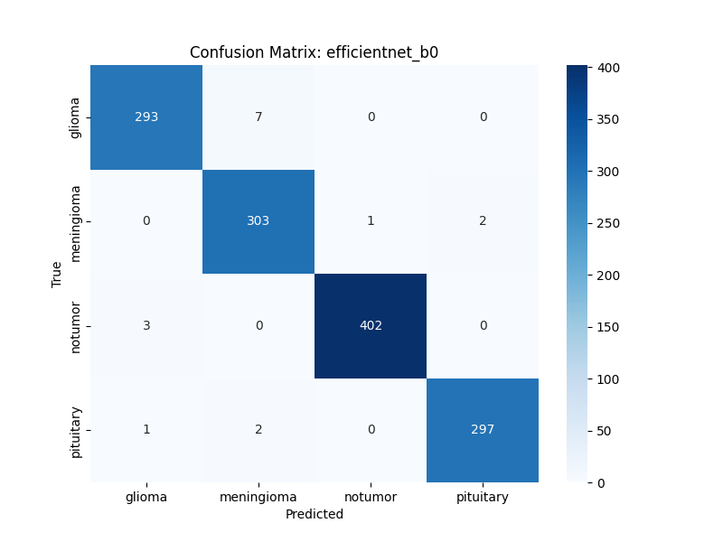

# 🧠 Brain Tumor Classification - Model Comparison

| Model | Best ROC AUC | Status |
|---|---|---|
| resnet18 | 0.9992 | ✅ Complete |
| resnet34 | 0.9993 | ✅ Complete |
| efficientnet_b0 | 0.9997 | ✅ Complete |
| mobilenetv3_large_100 | 0.9990 | ✅ Complete |
| vit_tiny_patch16_224 | 0.9921 | ✅ Complete |

## Detailed Metrics for Best Model
Best Overall Model: **efficientnet_b0** with ROC AUC of **0.9997**

### Classification Report
```
              precision    recall  f1-score   support

      glioma       0.99      0.98      0.98       300
  meningioma       0.97      0.99      0.98       306
     notumor       1.00      0.99      1.00       405
   pituitary       0.99      0.99      0.99       300

    accuracy                           0.99      1311
   macro avg       0.99      0.99      0.99      1311
weighted avg       0.99      0.99      0.99      1311

```

